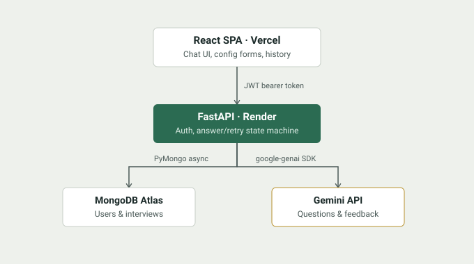

# AI Mock Interview

A text-based mock interview app: you set your target role, experience level, and
focus areas, then practice against an AI interviewer that asks follow-up
questions based on your actual answers, ends after a bounded number of
questions, and gives you specific, transcript-grounded feedback at the end.

**Live demo:** [https://interview-app-swart-six.vercel.app/](https://interview-app-swart-six.vercel.app/) &nbsp;·&nbsp;
**API:** [https://interview-app-backend-1wyp.onrender.com](https://interview-app-backend-1wyp.onrender.com/health)
<br><sub>(Render's free tier sleeps after 15 minutes idle — the first
request after a while will take 30–60s to wake up.)</sub>


## Screenshots

<!--
  Add real screenshots here before sharing this README. Suggested shots:
  - The interview setup form
  - A mid-interview chat screen (a couple of Q&A turns visible)
  - The completed-interview feedback screen
  - The history list
  Save them under docs/screenshots/ and reference them like:
  
-->


## What it does

1. Sign up and log in.
2. Set up an interview: target role, years of experience, skills/topics to
   focus on, and difficulty.
3. The AI asks an opening question, then works through the interview one
   question at a time — deciding turn by turn whether to follow up on your
   last answer or move to a new topic, based on the actual conversation.
4. After a fixed number of questions, it stops and gives you a rating (1–5),
   specific strengths and weaknesses, and suggestions — all grounded in what
   you actually said, not generic advice.
5. Every interview is saved. Reopen a finished one to review the feedback, or
   an unfinished one to pick up exactly where you left off.

## Why this exists

Built as a portfolio project to practice — and have something concrete to
discuss in — real SWE interviews: authentication and ownership design,
async database access patterns, integrating a third-party LLM API reliably
(including what happens when it fails mid-request), and shipping something
that's actually deployed rather than just running on localhost. It's a
practice tool, not a guarantee of anything about real interview outcomes.

## Features

- Email/password auth with JWT, hashed passwords, and per-request ownership
  checks — every interview is scoped to the user who created it
- An AI interviewer that reads the transcript so far and decides in-context
  whether to probe deeper or change topics, within a bound the backend
  enforces
- A retry-safe answer pipeline: if the AI call fails mid-turn, your answer
  is never lost and the exact same request is safe to resend — no duplicate
  turns, no stuck interviews
- Transcript-grounded feedback generated once an interview completes
- Interview history, with resume-in-progress and read-only review of
  completed ones
- A basic rate limiter protecting the AI provider's free-tier quota from a
  runaway retry loop

## Tech stack

| Layer | Choice | Why |
|---|---|---|
| Frontend | React + Vite | Fast dev loop, no framework overhead for an app this size |
| Backend | Python + FastAPI | Async-native, and Pydantic gives request/response validation for free |
| Database | MongoDB Atlas, via PyMongo's native async client | No ODM — a handful of collections didn't justify the extra abstraction; direct `AsyncMongoClient` calls stay easy to reason about and to explain |
| AI | Google Gemini API (`google-genai` SDK), structured JSON output | Free tier usable without billing; Pydantic schemas double as both the API's request validation and the shape the model is asked to return |
| Auth | Hand-rolled JWT (PyJWT + bcrypt), bearer token (not cookies) | Frontend and backend are deployed on different origins — a manually-attached header sidesteps cross-site cookie/CSRF complexity entirely |
| Deployment | Vercel (frontend) + Render (frontend) + MongoDB Atlas | All have genuinely free tiers usable without a credit card |

## Architecture



The backend is the only thing that talks to MongoDB or Gemini — the frontend
never holds a secret and never decides interview logic; it only renders what
the API returns. Every request to Mongo reloads the interview fresh (no
server-side session state), which is what lets "resume an interview" and "a
page refresh mid-interview" both just work with no special-case code.

## A few decisions worth knowing about

**The answer/retry state machine.** Submitting an answer is two steps: save
the answer (a conditional write, safe to retry), then call the AI to get the
next question or final feedback. If the AI call fails, the saved answer is
untouched and nothing else changed — the client can safely resend the exact
same request, which just retries the AI step without re-saving or
duplicating anything. Full reasoning and the MongoDB-specific gotchas hit
while building it are in [`docs/DEVELOPMENT.md`](docs/DEVELOPMENT.md).

**No ODM.** MongoDB's Motor driver was deprecated in favor of PyMongo's own
native async client partway through this project's design; adding Beanie or
another ODM on top would have meant learning a third abstraction for two
collections. Direct queries stay simple enough to fully explain, at the cost
of writing a bit of manual dict-to-Pydantic conversion by hand.

**Structured AI output, not free-text parsing.** Every Gemini call passes a
Pydantic model as `response_schema` and gets back an already-validated
instance via `response.parsed` — the same schema defines what's asked for
and validates what comes back, with no manual JSON parsing or regex.

## Getting started locally

```bash
# backend
cd backend
python3 -m venv .venv && source .venv/bin/activate
pip install -r requirements.txt
cp .env.example .env   # fill in MongoDB URI, JWT secret, Gemini API key
uvicorn app.main:app --reload

# frontend, in a second terminal
cd frontend
npm install
cp .env.example .env.local
npm run dev
```

You'll need a free MongoDB Atlas M0 cluster and a Gemini API key from Google
AI Studio — neither requires a credit card. Full step-by-step account setup,
troubleshooting for common first-run errors, and the milestone-by-milestone
build history are in [`docs/DEVELOPMENT.md`](docs/DEVELOPMENT.md).

## Testing

```bash
cd backend && pytest -v
```

31 tests, run against a real (isolated) MongoDB database rather than a
mocked one — the atomic conditional updates the retry logic depends on are
exactly the kind of behavior a mock could get subtly wrong. AI calls are
mocked via dependency injection, so the suite never makes a real network
call or spends API quota. Coverage: auth, ownership checks (a user can never
see or modify another user's data), the full answer/retry state machine
including forced AI-failure recovery, history, and rate limiting.

## Deployment

Backend on Render (see `render.yaml` at the repo root — a Blueprint that
provisions the service in one click), frontend on Vercel, database on the
same Atlas cluster used in development. Exact steps, in order, are in
[`docs/DEVELOPMENT.md`](docs/DEVELOPMENT.md#14-m8--deployment).

## Known limitations

Said plainly rather than left for someone else to discover:

- No email verification or password reset flow
- JWTs aren't revoked server-side on logout — logging out clears the
  client's copy, but a captured token would remain valid until it expires
  (2 hours)
- Single AI provider, no fallback if Gemini has an outage beyond its own
  built-in retry
- Render's free tier cold-starts after 15 minutes idle
- No CI pipeline — tests are run locally, not on push

## Possible next steps

- CI (GitHub Actions) running the test suite on every push
- Short-lived access token + refresh token, replacing the current
  single-long-lived-JWT approach
- A second AI provider as a fallback if Gemini is unavailable
- Streaming the AI's response token-by-token instead of waiting for the
  full question

## License

MIT — see `LICENSE` if you add one, or state your own preference here.
